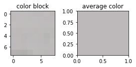
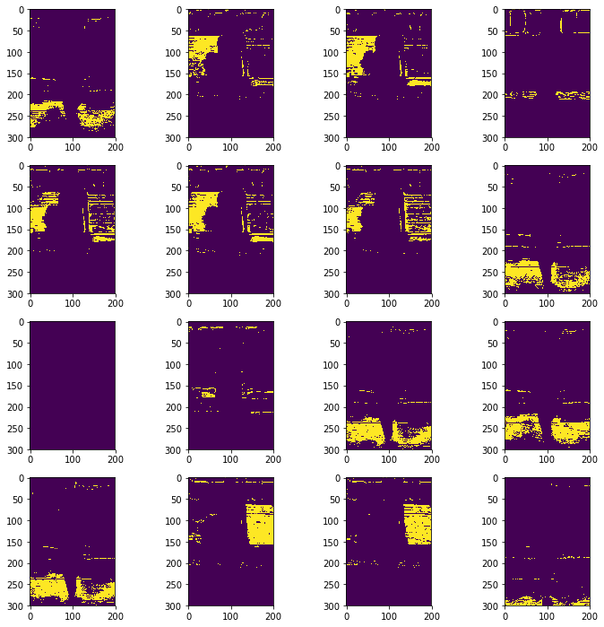
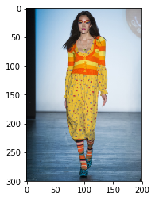

# Background Removal, Step 1


All code is from a stripped-down version of my CompositeMask class; code [here](github.link)

A clear first step toward isolating the garment is to remove the background. Most runway photos have a relatively simple background, although they can become cluttered by other models and audience members. Another complication is that the color of the garment can be similar to the color of the background.

For my first pass, I used a simple method of sampling random points in the background and removing pixels that fell within a certain range of those points. I defined the background as vertical slices at the right and left edges of the image, with a width of 1/8 the total width of the image. (This is a very conservative width, as the figure tends to take up only the middle third of the image.) I then selected several random points in these regions (default is 16 points) and took 9 pixel by 9 pixel blocks and found the average color of each block. (Arithmetic mean of each of the three color channels.)

```python

def avg_each_color(self, color_block, color_name):
    color_dict = {'red':0, 'green':1, 'blue':2}
    index = color_dict[color_name]
    all_colors = [color[index] for row in color_block for color in row]
    ave_color = sum(all_colors)/(len(all_colors) + .001)
    return ave_color

def get_background_colors(self, num_points):
    background_colors = []
    h, w, colors = self.image.shape
    points_per_side = int(num_points/2)

    self.left_coords = [(np.random.choice(h), \
                        np.random.choice(range(4, int(w/8)))) \
                        for i in range(points_per_side)]

    self.right_coords = [(np.random.choice(h), \
                        np.random.choice(range(int(7*w/8), w-4))) \
                        for i in range(points_per_side)]

    for row, col in self.left_coords + self.right_coords:
        color_block = self.image[int(row-4):int(row+4), \
                                int(col-4):int(col+4)]
        ave_color = [self.avg_each_color(color_block, color) for color in ['red', 'green', 'blue']]
        background_colors.append(ave_color)

    return background_colors
```

<div><table>
<tr>
<td></td>
<td></td>
</tr>
</table></div>


<div><table>
<tr>
<td></td>

</tr>
<tr>
<td></td>

</tr>
<tr>
<td></td>

</tr>
<tr>
<td></td>

</table></div>

Some color blocks were variegated, while others were virtually monochromatic.

I then used `OpenCV`'s `inRange` method to create a boolean mask locating colors within a certain range of the N average background colors. The range thresholds represent one of the parameters of my model; ultimately, the model will determine the optimal threshold itself based on intrinsic features of the image.

In the BGR model, each pixel is represented as a tuple of three integers between 0-255, or normalized as three decimals between 0 and 1. (I have found that some packages/methods will correctly infer either, while others require one or the other.) I used as my default threshold a range of 20 on either side--so, for example, if my original color was [210, 90, 120] I would mask all pixels falling within 190 and 230 on the blue channel, 70 and 110 on the green channel, and 100 and 140 on the red channel.

I created a mask for each of the 16 background colors picked out above.

<div><table>
<tr>
<td></td>
</tr>
</table></div>

I then added the masks together, such that any pixel that had been labelled background at least once was subtracted from the image, leaving only pixels that were never labelled background. This could obviously be adjusted as "majority rules" or another alternate proportion.

<div><table>
<tr>
<td></td>
</tr>
</table></div>

In this case, a threshold of 20 is too high. A threshold of 5 returns a much-improved result:

<div><table>
<tr>
<td></td>
</tr>
</table></div>

<div><table>
<tr>
<td></td>
</tr>
</table></div>

After a series of automated iterations, I found a threshold of 11 to be optimal for this image:

<div><table>
<tr>
<td></td>
</tr>
</table></div>

Through this iterative process, measuring success against manually segmented images, I was able to achieve high levels of both precision and recall on several sample images to serve as a baseline model. (thresholds are 18, 22, and 26 respectively) (More on these success metrics in another post.)

<div>
<table><tr><td></td><td></td></tr>
<tr><td></td><td></td></tr>
<tr><td></td><td></td></tr>

</table>
</div>


The goal, of course, is to find these optimal thresholds on unlabelled images. Further posts will explore potential inputs on which to train a model to this.
