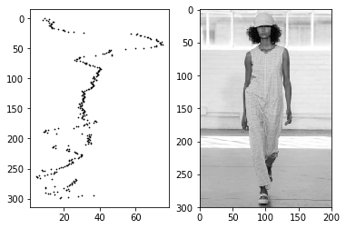
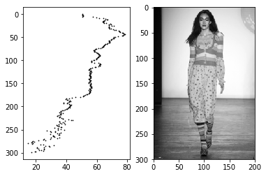
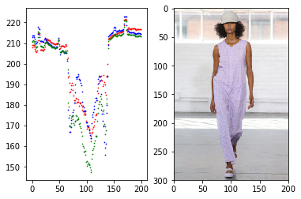

I am interested in exploring whether summary statistics of the color distribution of slices of runway images would be useful features in my garment extraction model.

I split the image into BGR color channels (the convention used by `OpenCV`) and found the standard deviation and average of each channel. I did the same for a grayscale version of the image.


```python
def get_std_devs(image, rows=False):
    std_devs = {}   
    for color, ci in zip(cv2.split(image), ['b', 'g', 'r']):
        if not rows:
            color = color.T
        std_devs[ci] = [np.std(row) for row in color]                
    return std_devs

def get_std_devs_grey(image, rows=False):
    image = cv2.cvtColor(image, cv2.COLOR_BGR2GRAY)
    if not rows:
        image = image.T
    return [np.std(row) for row in image]

def get_avgs(image, rows=False):
    avgs = {}   
    for color, ci in zip(cv2.split(image), ['b', 'g', 'r']):
        if not rows:
            color = color.T
        avgs[ci] = [np.mean(row) for row in color]                
    return avgs

def get_avgs_grey(image, rows=False):
    image = cv2.cvtColor(image, cv2.COLOR_BGR2GRAY)
    if not rows:
        image = image.T
    return [np.mean(row) for row in image]

```

I then plotted these findings next to the images themselves, to see whether there appeared to be a signal.

```python

def plot_std_devs(image, rows=False, grayscale=False):
    if not grayscale:
        std_dict = get_std_devs(image, rows)
    else:
        std_dict = {'k': get_std_devs_grey(image, rows)}

    if not rows:
        for std_devs, color in [(v, k) for k, v in std_dict.iteritems()]:
            plt.scatter(xrange(len(std_devs)), std_devs, c=color, s=.5)

    else:
        for std_devs, color in [(v, k) for k, v in std_dict.iteritems()]:
            plt.scatter(std_devs, xrange(len(std_devs)), c=color, s=.5)
            plt.gca().invert_yaxis()

def show_image_and_std_devs(image, rows=False, grayscale=False):
    fig = plt.figure()
    fig.add_subplot(1,2,1)
    plot_std_devs(image, rows, grayscale)
    fig.add_subplot(1,2,2)
    if not grayscale:
        plt.imshow(utils.bgr_to_rgb(image))
    else:
        plt.imshow(cv2.cvtColor(image, cv2.COLOR_BGR2GRAY), cmap='gray')
    plt.show()

```

Unsurprisingly, the left-to-right plots are largely symmetrical and there are marked changes at the left and right boundaries of the figures.

Since there are other methods to approximately locate the figure in runway images (by identifying the size and location of the face, or even just guessing that the figure takes up roughly the middle third of the image), I am more interested in using this information to better understand the color relationship between the background and the figure.

<div>
<table>
  <tr>
  	<td rowspan="4">standard deviations</td>
    <td></td>
    <td></td>

  </tr>
  <tr>
  <td></td>
  <td></td>

  </tr>
  <tr>
  <td></td>
  <td></td>

  </tr>
  <tr>
  <td></td>
  <td></td>

  </tr>


  <tr>
    <td rowspan="4">averages</td>
    <td></td>
    <td></td>

  </tr>
  <tr>
  <td></td>
  <td></td>

  </tr>
  <tr>
  <td></td>
  <td></td>

  </tr>
  <tr>
  <td></td>
  <td></td>

  </tr>

</table>
</div>
